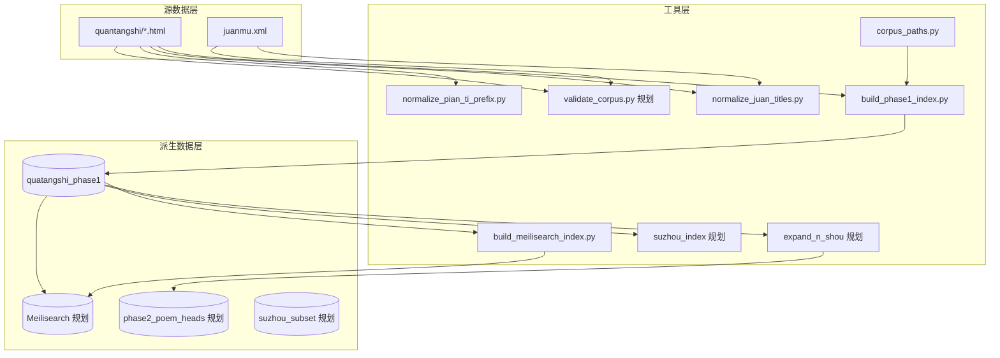

# 05 — 系统架构

## 5.1 架构原则

1. **HTML 为源真相**：索引均为派生，可删除 `index/` 后重建。
2. **分层索引**：Phase 1 篇题块 → Phase 2 诗首/专题/检索视图。
3. **推断与定稿分离**：自动结果带 `*_note` / `*_confidence`，不覆盖源文件。
4. **脚本化运维**：无长期运行服务；命令行批处理。

## 5.2 逻辑架构图



## 5.3 模块职责

| 模块 | 职责 | 读写 |
|------|------|------|
| `corpus_paths` | 根路径、语料目录、卷目文件 | 只读配置 |
| `normalize_*` | 批量规范化 HTML / juanmu | 写语料 |
| `build_phase1_index` | 解析 HTML → SQLite + JSONL | 写 index |
| `validate_corpus`（规划） | 一致性检查，退出码非 0 表示失败 | 只读 |
| `expand_n_shou`（规划） | 读 Phase 1 → Phase 2a | 写 index |
| `build_meilisearch_index` | JSONL → Meilisearch | 写检索服务 |
| `query_meilisearch` | 命令行检索 | 只读 |
| `suzhou_index`（规划） | 地名表 + 匹配 → 子集 | 写 index |

## 5.4 数据流（典型）

**日常校对**

```
编辑 text*.html [+ juanmu.xml]
    → python tools/build_phase1_index.py
    → 使用 index/quatangshi_phase1.sqlite 查询
```

**批量规范化**

```
python tools/normalize_juan_titles.py
python tools/normalize_pian_ti_prefix.py   # 按需
python tools/build_phase1_index.py
```

**二期展开（规划）**

```
python tools/build_phase1_index.py
    → python tools/expand_n_shou_phase2.py
    → （可选）python tools/build_suzhou_index.py
```

## 5.5 部署形态

- **无服务器**：单机文件夹 + Python。
- **可选 Git**：语料与脚本版本化；大文件（sqlite/jsonl）是否入库见未决问题。
- **未来 Web/API**：不在本期架构内；若需要，应作为消费 `index/` 的只读上层。

## 5.6 扩展点

| 扩展点 | 方式 |
|--------|------|
| 分首规则 | `tools/split_plans/{id}.json` 指定每首句数序列 |
| 地名表 | `tools/lexicon/places_suzhou.txt` |
| 外源诗人信息 | 独立 CSV，通过 `zuo_zhe` 关联，不写入 HTML |
| 环境路径 | `QTS_CORPUS`、`QTS_JUANMU` 环境变量 |
