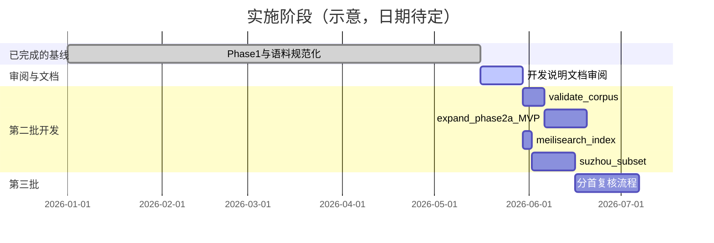

# 11 — 实施路线图

## 11.1 阶段划分

## 11.2 里程碑

| 里程碑 | 交付物 | 依赖 |
|--------|--------|------|
| **M0** 基线 | Phase 1 索引、规范脚本、juanmu | ✅ 已达 |
| **M1** 文档批准 | 本套 `docs/` 审阅签字（或标记已批准） | 你审阅 |
| **M2** 门禁 | `validate_corpus.py` + 报告格式 | M1 |
| **M3** 诗首 MVP | `expand_n_shou_phase2.py` + split_plans 范例 | M2 |
| **M4** 检索服务 | Meilisearch 导入 + 查询脚本 | M1 |
| **M5** 专题 | 苏州子集 | M4 |
| **M6** 复核闭环 | 导出待复核 CSV、`verified` 工作流 | M3 |

## 11.3 M2：`validate_corpus.py` 范围

- 实现文档 10.2 中 V1–V4。
- 输出 `index/validate_report.json`。
- 不写 HTML。

## 11.4 M3：Phase 2a MVP 范围

**做：**

- 读 Phase 1 JSONL。
- 支持 `split_plans/*.json`。
- 支持 uniform「N 首」拆（句数整除 + 每首 2/4/8/12）。
- 写 `quatangshi_phase2_heads.jsonl`。
- 统计报告 stdout。

**不做：**

- 改 HTML。
- 自动改 `split_note` 为 `verified`。
- 乐府不等长组诗全自动。

## 11.5 M4：Meilisearch（已提供脚本）

**做：**

- `docker-compose.yml` 本地服务。
- `build_meilisearch_index.py` / `query_meilisearch.py`。
- 文档 [13-Meilisearch检索服务.md](13-Meilisearch检索服务.md)。

**不做：**

- 托管云 Meilisearch（可自行选用）。

## 11.6 M5：苏州子集

**做：**

- `tools/lexicon/places_suzhou.txt`（初版词表）。
- `build_suzhou_index.py` → `index/suzhou_phase1.jsonl`。
- 可选：单独 Meilisearch 索引 `suzhou`。

**不做：**

- Web UI。
- 诗人年表。

## 11.7 资源与风险（摘要）

| 风险 | 缓解 |
|------|------|
| 分首规则误判 | 默认 needs_review + split_plan |
| 词表漏/误收苏州诗 | 公开词表、可迭代 |
| 大文件 Git | LFS 或 CI 生成索引 |
| 底本版权 | 在未决文档中明确来源 |

## 11.8 审阅后第一步（建议）

1. 阅读 `12-未决问题与决策记录.md` 并填写/勾选。
2. 在 `docs/README.md` 将状态改为「已批准 v0.2」。
3. 开发顺序：**M2 → M4（Meilisearch）→ M3（诗首）→ M5（苏州）**。
