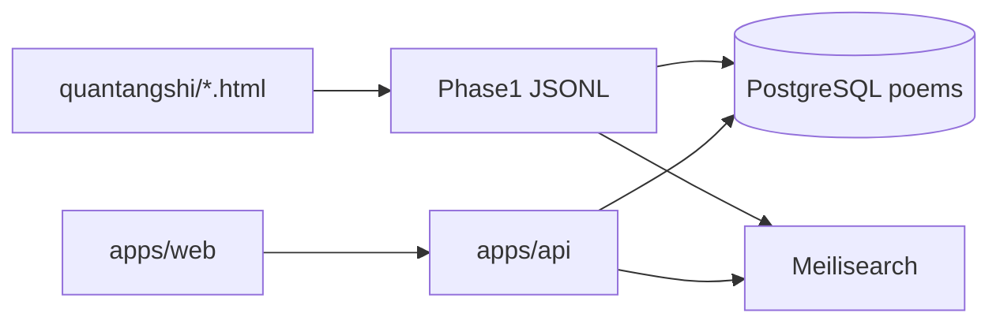

# 14 — 检索 MVP 开发计划（PostgreSQL）

**状态**：执行中（2026-05-16）  
**决策**：HTML 为源真相；Phase 1 派生；PostgreSQL 存运营副本与 enrichment；Meilisearch 负责全文检索。

## 阶段 A（本期交付）

| 项 | 交付物 | 状态 |
|----|--------|------|
| A1 | `docker-compose.yml`：PostgreSQL + Meilisearch | ✅ |
| A2 | `db/schema.sql` + `tools/sync_postgres.py` | ✅ |
| A3 | `apps/api` FastAPI：搜索、详情、筛选项 | ✅ |
| A4 | `apps/web` React：全文检索 + 体裁/作者/卷筛选 | ✅ |
| A5 | Meilisearch 增强字段 `has_parse_note`、`has_author` | ✅ |

## 阶段 B（后续）

- `validate_corpus.py`（M2）
- Phase 2a 诗首展开视图
- 苏州子集 + `poem_enrichment` 审校后台
- 意象 / SpatialHub（LLM 候选 + `verified`）

## 本地启动

```bash
# 1. 基础设施
cp .env.example .env
docker compose up -d

# 2. 索引
pip install -r requirements-search.txt -r apps/api/requirements.txt
python tools/build_phase1_index.py
python tools/build_meilisearch_index.py --recreate
python tools/sync_postgres.py

# 3. API
cd apps/api && uvicorn app.main:app --reload --port 8000

# 4. 前端
cd apps/web && npm install && npm run dev
```

- API 文档：http://127.0.0.1:8000/docs  
- 前端：http://127.0.0.1:5173  

## 数据流



## PostgreSQL 表（本期）

- `poems`：与 Phase 1 同构，主键 `id`
- `poem_enrichment`：语义扩展占位（空表，供阶段 B）
- `audit_log`：审校日志占位

## API 概要

| 方法 | 路径 | 说明 |
|------|------|------|
| GET | `/api/health` | 健康检查 |
| GET | `/api/search` | Meilisearch 全文 + 筛选 |
| GET | `/api/poems/{id}` | PostgreSQL 详情 |
| GET | `/api/meta/authors` | 作者联想 |
| GET | `/api/meta/juan` | 卷名列表 |
| GET | `/api/meta/ticai` | 体裁大类/小类 |
